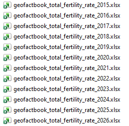
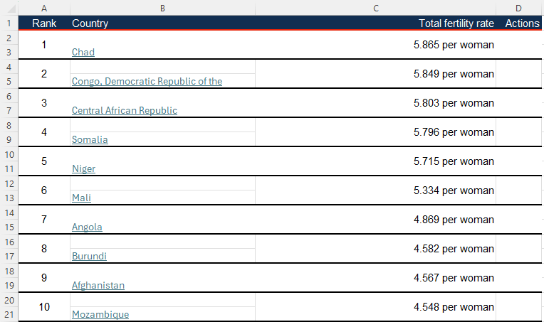
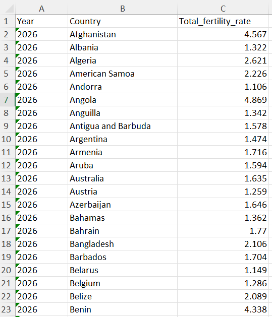
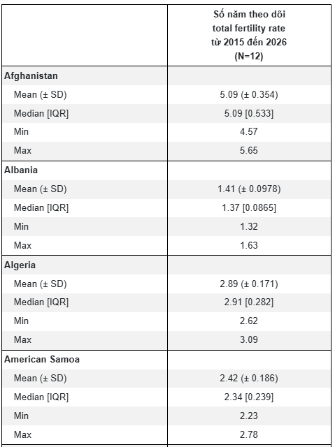

```{r, echo=FALSE, results='hide'}
knitr::opts_chunk$set(message = FALSE,  
                      warning = FALSE)   
```

# **Bài tập làm sạch dữ liệu** 

## **Câu 1** {#cau-1}

Trang web này có thông tin về tỷ lệ sinh toàn cầu theo từng quốc gia và theo năm <https://geofactbook.com/fact/total-fertility-rate/2026> tuy nhiên bản đồ heatmap vẽ không chuẩn (thiếu chú thích scale màu) và không có file CSV dataset raw để ta có thể tự vẽ lại được bản đồ này.

Để tìm data raw theo hướng dẫn của trang này thì phải truy về dữ liệu của United Nations Population Division rất mất thời gian, trong khi đó ta chỉ cần dữ liệu Total Fertility Rate theo như bảng kết quả họ trình bày trên web.

Mình đã copy lần lượt các bảng HTML này vào file Excel như sau. [download](https://filedn.com/lesyJpQOCafj7katNqunAxu/TUHOCR/STAT/202610_grow_K1/dataset/data_tfr.rar)



Tuy nhiên copy table HTML về file Excel thì định dạng sẽ theo format này, ta chưa thể sử dụng được ngay mà cần có bước làm sạch gộp lại lại dữ liệu cho chuẩn mới có thể tiến hành phân tích.



Vì vậy bài tập này sẽ là tình huống thực tế để chúng ta thực hiện các công việc:

**1/ Gộp dữ liệu từ các file Excel riêng lẽ thành 1 file dataset hoàn chỉnh.** 

File cần thực hiện: [Final dataset](https://filedn.com/lesyJpQOCafj7katNqunAxu/TUHOCR/STAT/202610_grow_K1/dataset/total_fertility_rate_2015_2026.xlsx)

Dataset ở dạng long, kết quả thể hiện rõ ràng theo từng năm, quốc gia và tỷ lệ sinh (số em bé mà trung bình 1 phụ nữ sinh ra trong năm đó).




**2/ Trên cơ sở file dataset final này, ta thống kê nhanh trung bình tỷ lệ sinh trong giai đoạn 2015-2026 theo từng quốc gia.**

Sử dụng package `table1`, kết quả cần thu được như sau.




::: {.callout-tip collapse="true" title="Đáp án"}

<style>
div.yes123 pre { background-color:#fff2cc; font-size: 16px; }
div.yes123 pre.r { background-color:#F1F3F5; font-size: 16px; }
</style>
<div class = "yes123">

Các bạn download folder project về và giải nén, xem đoạn code xử lý làm sạch dữ liệu nhé.

[Solution](https://filedn.com/lesyJpQOCafj7katNqunAxu/TUHOCR/STAT/202610_grow_K1/dataset/PROJECT_FERTILITY.rar)

</div>

:::


