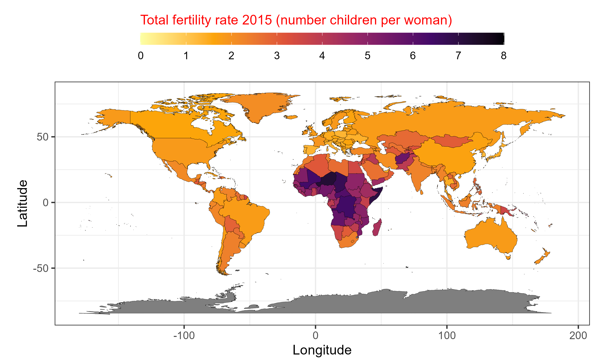
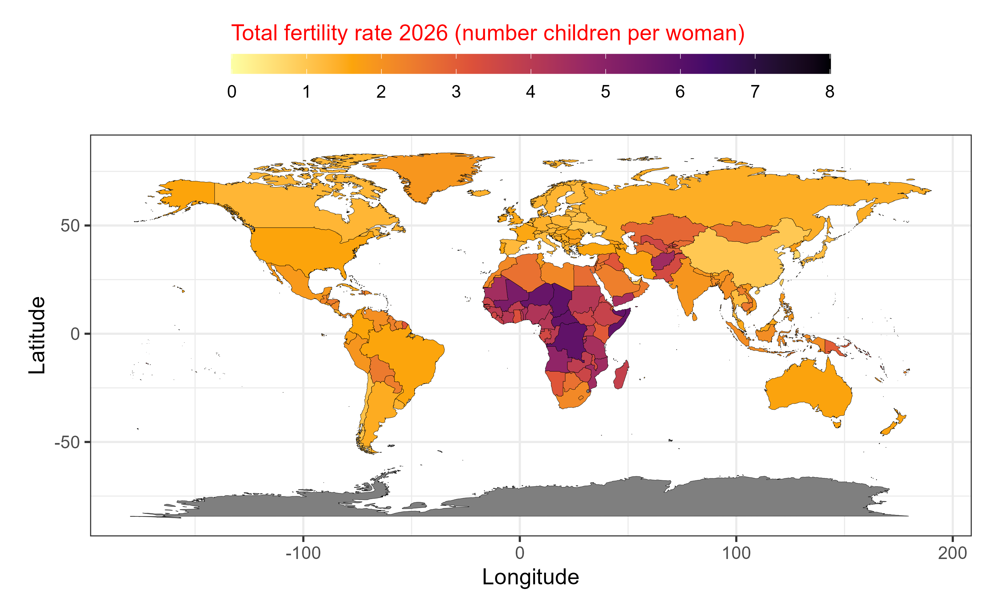

```{r, echo=FALSE, results='hide'}
knitr::opts_chunk$set(message = FALSE,  
                      warning = FALSE)   
```

# **Bài tập vẽ bản đồ** 

## **Câu 1** {#cau-1}

Trên cơ sở [bài tập gộp và làm sạch dữ liệu tỷ lệ sinh toàn cầu](https://tuhocr.github.io/homework/bai-tap-clean-du-lieu-tfr.html#cau-1), ta có file dataset từ năm 2015 đến 2026 về tỷ lệ sinh của các quốc gia trên thế giới. [total_fertility_rate_2015_2026.xlsx](https://filedn.com/lesyJpQOCafj7katNqunAxu/TUHOCR/STAT/202610_grow_K1/dataset/total_fertility_rate_2015_2026.xlsx).

Bạn hãy trích xuất ra dữ liệu của hai năm 2015 và 2026 để vẽ bản đồ sau.





**Gợi ý thực hiện:**

* Bạn có thể sử dụng dataset worldmap để vẽ bản đồ nền bằng package `ggplot2`

```{r}
library(ggplot2)
world <- ggplot2:::map_data("world")

set.seed(1)

ggplot() +
  
  geom_polygon(data = world,
               aes(x = long,
                   y = lat, 
                   group = group,
                   fill = as.factor(group))) + 
  
  coord_equal() +
  
  theme(legend.position = "none")
```

* Một số tên quốc gia trong dataset `total_fertility_rate_2015_2026.xlsx` sẽ khác với trong dataset `world` bạn cần chuẩn lại cùng tên để có thể vẽ được bản đồ heatmap theo tỷ lệ sinh.


::: {.callout-tip collapse="true" title="Đáp án"}

<style>
div.yes123 pre { background-color:#fff2cc; font-size: 16px; }
div.yes123 pre.r { background-color:#F1F3F5; font-size: 16px; }
</style>
<div class = "yes123">

Đoạn code sau mình vẽ cho dữ liệu năm 2026

### Import dataset 

```{r}
library(readxl)
df <- read_excel("dataset/total_fertility_rate_2015_2026.xlsx")
df <- as.data.frame(df)
df <- df |> subset(Year == "2026")
```

### Import worldmap

```{r}
library(ggplot2)
world <- map_data("world")
```

### Chuẩn lại tên quốc gia

```{r}
df_Antigua <- df |> subset(Country == "Antigua and Barbuda")
df_Antigua$Country <- "Antigua"

df_Barbuda <- df |> subset(Country == "Antigua and Barbuda")
df_Barbuda$Country <- "Barbuda"

df <- df |> subset(Country != "Antigua and Barbuda")

df <- rbind(df, df_Antigua, df_Barbuda)

row.names(df) <- NULL

df |> dplyr:::arrange(desc(Year), Country) -> df
```

```{r}
df$Country[which(df$Country == "Brunei Darussalam")] <- "Brunei"
```

```{r}
df$Country[which(df$Country == "United States")] <- "USA"
```

```{r}
df$Country[which(df$Country == "United Kingdom")] <- "UK"

df$Country[which(df$Country == "Republic of Moldova")] <- "Moldova"

df$Country[which(df$Country == "Bonaire, Sint Eustatius and Saba")] <- "Bonaire"

df$Country[which(df$Country == "Congo, Democratic Republic of the")] <- "Democratic Republic of the Congo"

df$Country[which(df$Country == "Congo")] <- "Republic of Congo"

df$Country[which(df$Country == "Curaçao")] <- "Curacao"

df$Country[which(df$Country == "British Virgin Islands" )] <- "Virgin Islands"

df$Country[which(df$Country == "State of Palestine" )] <- "Palestine"

df$Country[which(df$Country == "Cabo Verde" )] <- "Cape Verde"

df$Country[which(df$Country == "Syrian Arab Republic" )] <- "Syria"

df$Country[which(df$Country == "Trinidad and Tobago" )] <- "Tobago"

df$Country[which(df$Country == "Côte d'Ivoire" )] <- "Ivory Coast"
```

### Setdiff

Kiểm tra xem tên quốc gia ở hai dataset có khác biệt không để clean lại lần nữa.

```{r}
unique(world$region) -> country_map

unique(df$Country) -> country_tfr

setdiff(country_tfr, country_map) # ten quoc gia co trong tfr nhung ko co trong country_map

setdiff(country_map, country_tfr) # ten quoc gia co trong country_map nhung ko co trong tfr
```

### Chuẩn cột `Total_fertility_rate`

```{r}
gsub(pattern = " per woman",
     replacement = "",
     df$Total_fertility_rate) -> df$Total_fertility_rate

df$Total_fertility_rate <- as.numeric(df$Total_fertility_rate)
```

```{r}
names(df)[2] <- "region"
```

### Merge

```{r}
world_ok <- merge(x = world,
                  y = df[ , 2:3],
                  all.x = TRUE,
                  by = "region")
```

```{r}
world_ok <- world_ok[ , c(names(world), "Total_fertility_rate")]
```

```{r}
world_ok |> dplyr:::arrange(order) -> world_ok
```

```{r}
identical(sort(world_ok$order), sort(world$order))

identical(world_ok$order, world$order)
```

```{r}
summary(df$Total_fertility_rate)
```

```{r}
# những quốc gia không có thông tin tỷ lệ sinh
world_ok_NA <- world_ok[which(is.na(world_ok$Total_fertility_rate)) , ]
unique(world_ok_NA$region)
```

### Plot

```{r}
worldplot <- ggplot() +
  
  geom_polygon(data = world_ok,
               aes(x = long,
                   y = lat, 
                   group = group,
                   fill = Total_fertility_rate),
               color = "black",
               lwd = 0.1) + 
  
  coord_equal() +
  scale_fill_viridis_c(option = "B",
                       direction = -1,
                       name = "Total fertility rate 2026 (number children per woman)",
                       limits = c(0,8),
                       breaks = c(0:8),
                       guide = guide_colorbar(barwidth = 30,
                                              barheight = 1)) +
  
  
  theme_bw(base_size = 16) +
  
  theme(legend.position = "top") +
  
  theme(legend.direction = "horizontal") +
  
  theme(legend.title.position  = "top") +
  
  theme(legend.title  = element_text(color = "red",
                                     size = 16)) +
  
  labs(x = "Longitude",
       y = "Latitude")
# worldplot
```


```{r}
# ggsave(filename = "worldplot_2026.png",
#        plot = worldplot,
#        width = 10,
#        height = 6,
#        dpi = 300,
#        units = "in")
```

</div>

:::


