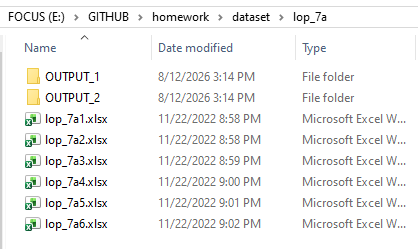
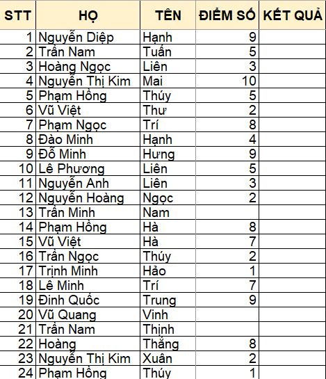

```{r, echo=FALSE, results='hide'}
knitr::opts_chunk$set(message = FALSE,  
                      warning = FALSE)   
```

# **Các lệnh if-else, for-loop** 

## **Câu 1** {#cau-1}

<!-- <style> -->
<!-- div.blue pre { background-color:#fff2cc; font-size: 22px; } -->
<!-- </style> -->

<!-- <div class = "blue"> -->

Bạn có bộ dữ liệu sau gồm 6 file Excel là số điểm của học sinh ở các lớp 7a1 đến 7a6. [[download]](https://filedn.com/lesyJpQOCafj7katNqunAxu/TUHOCR/RPC/202607_thanks_K2/dataset/lop_7a.rar)



Cụ thể, ta xem trong 1 file, ta sẽ thấy có 2 cột là `ĐIỂM SỐ` và `KẾT QUẢ`.



Bạn hãy thực hiện lệnh điều kiện để phân loại điểm số học sinh như sau:

• 10 - 9 : GIỎI

• >9 - 7 : KHÁ  

• >7 - 5 : TRUNG BÌNH KHÁ

• >5 - 3 : YẾU

• >3 - 0 : KÉM

• KHÔNG CÓ ĐIỂM: KHÔNG ĐI THI

Sau đó bạn thực hiện lệnh vòng lặp for-loop để tính toán nhanh các file này và xuất ra folder `OUTPUT`.

Ta sẽ làm 2 cách, sử dụng function `dplyr:::case_when()` xuất ra folder `OUTPUT_1` và function `if-else` của Base R xuất ra folder `OUTPUT_2`.

<!-- </div> -->

::: {.callout-tip collapse="true" title="Đáp án"}

<style>
div.yes123 pre { background-color:#fff2cc; font-size: 16px; }
div.yes123 pre.r { background-color:#F1F3F5; font-size: 16px; }
</style>
<div class = "yes123">

## Import file

```{r}
file_data <- list.files(path = "dataset/lop_7a",
                        full.names = TRUE, 
                        pattern = "*.xlsx")

file_data
```

## Dùng `dplyr:::case_when()`

### Xử lý chuẩn 1 file

```{r}
library(readxl)
df <- read_excel(file_data[1])
df <- as.data.frame(df)
head(df, n = 10)
```

```{r}
library(dplyr)

# thứ tự điều kiện ưu tiên đi từ trên xuống

df |> dplyr:::mutate(`KẾT QUẢ` = case_when(
  
  is.na(`ĐIỂM SỐ`) == TRUE ~ "KHÔNG ĐI THI",
  
  (is.na(`ĐIỂM SỐ`) == FALSE) &  `ĐIỂM SỐ` >= 9 & `ĐIỂM SỐ` <= 10 ~ "GIỎI",
  
  (is.na(`ĐIỂM SỐ`) == FALSE) &  `ĐIỂM SỐ` >= 7 & `ĐIỂM SỐ` < 9 ~ "KHÁ",
  
  (is.na(`ĐIỂM SỐ`) == FALSE) &  `ĐIỂM SỐ` >= 5 & `ĐIỂM SỐ` < 7 ~ "TRUNG BÌNH KHÁ",
  
  (is.na(`ĐIỂM SỐ`) == FALSE) &  `ĐIỂM SỐ` >= 3 & `ĐIỂM SỐ` < 5 ~ "YẾU",
  
  (is.na(`ĐIỂM SỐ`) == FALSE) &  `ĐIỂM SỐ` >= 0 & `ĐIỂM SỐ` < 3 ~ "KÉM",
  
  .default = NA
  
)) -> df_out_1

# Kiểm tra kết quả xem lệnh này đã tính toán ổn trên 1 file chưa
head(df_out_1, n = 10)
```

### Xử lý vòng lặp for-loop

```{r}
library(openxlsx)

for(i in 1:length(file_data)){

library(readxl)
df <- read_excel(file_data[i])
df <- as.data.frame(df)

library(dplyr)

# thứ tự điều kiện ưu tiên đi từ trên xuống

df |> dplyr:::mutate(`KẾT QUẢ` = case_when(
  
  is.na(`ĐIỂM SỐ`) == TRUE ~ "KHÔNG ĐI THI",
  
  (is.na(`ĐIỂM SỐ`) == FALSE) &  `ĐIỂM SỐ` >= 9 & `ĐIỂM SỐ` <= 10 ~ "GIỎI",
  
  (is.na(`ĐIỂM SỐ`) == FALSE) &  `ĐIỂM SỐ` >= 7 & `ĐIỂM SỐ` < 9 ~ "KHÁ",
  
  (is.na(`ĐIỂM SỐ`) == FALSE) &  `ĐIỂM SỐ` >= 5 & `ĐIỂM SỐ` < 7 ~ "TRUNG BÌNH KHÁ",
  
  (is.na(`ĐIỂM SỐ`) == FALSE) &  `ĐIỂM SỐ` >= 3 & `ĐIỂM SỐ` < 5 ~ "YẾU",
  
  (is.na(`ĐIỂM SỐ`) == FALSE) &  `ĐIỂM SỐ` >= 0 & `ĐIỂM SỐ` < 3 ~ "KÉM",
  
  .default = NA
  
)) -> df_out


output <- basename(file_data[i])

output_name <- paste0("dataset/lop_7a/OUTPUT_1/", output)

openxlsx:::write.xlsx(x = df_out,
                      file = output_name)

}
```

## Dùng `ifelse()`

### Xử lý chuẩn 1 file

```{r}
library(readxl)
df <- read_excel(file_data[1])
df <- as.data.frame(df)
head(df, n = 10)
```

```{r}
diem_thi <- df$`ĐIỂM SỐ`


for(j in 1:length(diem_thi)) {
        
        if(!(is.na(diem_thi[j])) & diem_thi[j] >= 9) {
            
          df$`KẾT QUẢ`[j] <- "GIỎI"
          
        } else if(!(is.na(diem_thi[j])) & diem_thi[j] >= 7) {
          
            df$`KẾT QUẢ`[j] <- "KHÁ"
            
        } else if(!(is.na(diem_thi[j])) & diem_thi[j] >= 5) {
          
            df$`KẾT QUẢ`[j] <- "TRUNG BÌNH KHÁ"
            
        } else if(!(is.na(diem_thi[j])) & diem_thi[j] >= 3) {
          
            df$`KẾT QUẢ`[j] <- "YẾU"
            
        } else if(!(is.na(diem_thi[j])) & diem_thi[j] >= 0) {
          
            df$`KẾT QUẢ`[j] <- "KÉM"
            
        } else if(is.na(diem_thi[j])) {
          
            df$`KẾT QUẢ`[j] <- "KHÔNG ĐI THI"
            
        } else {
          
            df$`KẾT QUẢ`[j] <- NA
            
        }
        
}

df -> df_out_2
```

**Kiểm tra xem kết quả tính bằng `case_when()` và `if-else` có giống nhau không.**

```{r}
identical(df_out_1, df_out_2)
```

### Xử lý vòng lặp for-loop

```{r}
library(openxlsx)

for(i in 1:length(file_data)){

library(readxl)
df <- read_excel(file_data[i])

df <- as.data.frame(df)

diem_thi <- df$`ĐIỂM SỐ`


for(j in 1:length(diem_thi)) {
        
        if(!(is.na(diem_thi[j])) & diem_thi[j] >= 9) {
            
          df$`KẾT QUẢ`[j] <- "GIỎI"
          
        } else if(!(is.na(diem_thi[j])) & diem_thi[j] >= 7) {
          
            df$`KẾT QUẢ`[j] <- "KHÁ"
            
        } else if(!(is.na(diem_thi[j])) & diem_thi[j] >= 5) {
          
            df$`KẾT QUẢ`[j] <- "TRUNG BÌNH KHÁ"
            
        } else if(!(is.na(diem_thi[j])) & diem_thi[j] >= 3) {
          
            df$`KẾT QUẢ`[j] <- "YẾU"
            
        } else if(!(is.na(diem_thi[j])) & diem_thi[j] >= 0) {
          
            df$`KẾT QUẢ`[j] <- "KÉM"
            
        } else if(is.na(diem_thi[j])) {
          
            df$`KẾT QUẢ`[j] <- "KHÔNG ĐI THI"
            
        } else {
          
            df$`KẾT QUẢ`[j] <- NA
            
        }
        
}

df -> df_out

output <- basename(file_data[i])

output_name <- paste0("dataset/lop_7a/OUTPUT_2/", output)

openxlsx:::write.xlsx(x = df_out,
                      file = output_name)

}
```

## CHECK

Ta có thể import lại cùng một file được tính bằng 2 cách khác nhau để xem kết quả có giống nhau không, cho thấy dùng cách `case_when()` hay `if-else` đều được.

```{r}
library(readxl)
lop_7a5_cach1 <- read_excel("dataset/lop_7a/OUTPUT_1/lop_7a5.xlsx")

lop_7a5_cach2 <- read_excel("dataset/lop_7a/OUTPUT_2/lop_7a5.xlsx")

identical(lop_7a5_cach1, lop_7a5_cach2)
```

</div>

:::


