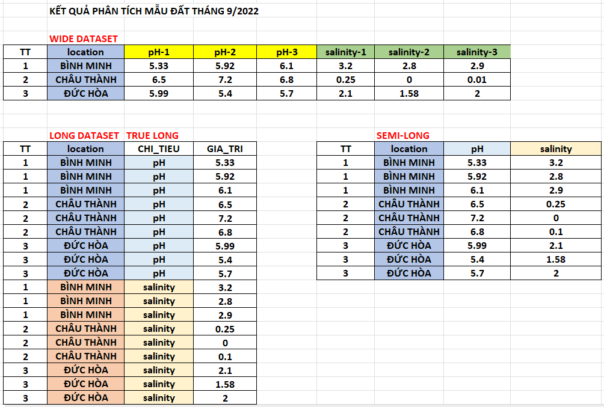

```{r, echo=FALSE, results='hide'}
knitr::opts_chunk$set(message = FALSE,  
                      warning = FALSE)   
```

# **Các lệnh sắp xếp dữ liệu** 

## **Câu 1** {#cau-1}

Sử dụng dataset `df1.rds`

<https://github.com/tuhocr/homework/blob/main/dataset/df1.rds>

Bạn có bộ dữ liệu sau, đây là kết quả đo chỉ số `CD3+_T_CELL_FREQ` ở hai thời điểm trước và sau. Ta sẽ thấy trong nhóm `CONTROL_OLD` và `CONTROL_YOUNG` ở cột `BEGIN_CD3+_T_CELL_FREQ` có đủ dữ liệu, trong khi ở cột `FU_CD3+_T_CELL_FREQ` tương ứng thì bị thiếu dữ liệu.

```{r}
df <- readRDS("dataset/df1.rds")

df
```

Bạn hãy chuyển dữ liệu từ cột `BEGIN` qua cột `FU` chỉ dành cho hai nhóm `CONTROL_OLD` và `CONTROL_YOUNG`, để thu được kết quả như sau, cột mới tạo đặt tên là `FU_CD3+_T_CELL_FREQ_new`.

```{r, echo=F}
library(dplyr)
library(rlang)

df %>% dplyr:::mutate( `FU_CD3+_T_CELL_FREQ_new` = case_when(
  
  STUDY_ARM == "CONTROL_OLD" ~ `BEGIN_CD3+_T_CELL_FREQ`,
  
  STUDY_ARM == "CONTROL_YOUNG" ~ `BEGIN_CD3+_T_CELL_FREQ`,
  
  STUDY_ARM == "YEGD" ~ `FU_CD3+_T_CELL_FREQ`,
  
  .default = NA
  
)) -> df_clean

df_clean
```


::: {.callout-tip collapse="true" title="Đáp án"}

**Cách 1: Khai báo trực tiếp tên biến**

Chú ý nếu tên biến có ký tự đặc biệt thì cần đặt trong hai dấu backticks ` `` `

```{r}
df <- readRDS("dataset/df1.rds")

library(dplyr)
library(rlang)

df %>% dplyr:::mutate( `FU_CD3+_T_CELL_FREQ_new` = case_when(
  
  STUDY_ARM == "CONTROL_OLD" ~ `BEGIN_CD3+_T_CELL_FREQ`,
  
  STUDY_ARM == "CONTROL_YOUNG" ~ `BEGIN_CD3+_T_CELL_FREQ`,
  
  STUDY_ARM == "YEGD" ~ `FU_CD3+_T_CELL_FREQ`,
  
  .default = NA
  
)) -> df_clean1

df_clean1
```

**Cách 2: Khai báo tên biến theo kiểu truyền tham số**

Từ khóa: pass variable in `dplyr`; dynamic variable/column in `dplyr` 

```{r}
df <- readRDS("dataset/df1.rds")

v1 <- "BEGIN_CD3+_T_CELL_FREQ"

v2 <- "FU_CD3+_T_CELL_FREQ"

v3 <- "FU_CD3+_T_CELL_FREQ_new"

library(dplyr)
library(rlang)

df %>% dplyr:::mutate( {{ v3 }} := case_when(
  
  STUDY_ARM == "CONTROL_OLD" ~ get(v1),
  
  STUDY_ARM == "CONTROL_YOUNG" ~ get(v1),
  
  STUDY_ARM == "YEGD" ~ get(v2),
  
  .default = NA
  
)) -> df_clean2

df_clean2
```

**Xác nhận kết quả tính bằng hai cách là như nhau**

```{r}
identical(df_clean1, df_clean2)
```

:::

## **Câu 2** {#cau-2}

Sử dụng dataset [`ket_qua_phan_tich_dat_full.xlsx`](https://filedn.com/lesyJpQOCafj7katNqunAxu/TUHOCR/RPC/202607_thanks_K2/dataset/ket_qua_phan_tich_dat_full.xlsx)

```{r}
library(readxl)
df <- read_excel("dataset/ket_qua_phan_tich_dat_full.xlsx",
                 range = "B7:I10")

df <- as.data.frame(df)

df
```

Bạn hãy chuyển dữ liệu thành dạng true long (mỗi dòng là 1 ID không trùng lặp với 1 value) và dạng semi long (có 2 value trên cùng ID).



::: {.callout-tip collapse="true" title="Đáp án"}

<style>
div.yes123 pre { background-color:#fff2cc; font-size: 16px; }
div.yes123 pre.r { background-color:#F1F3F5; font-size: 16px; }
</style>
<div class = "yes123">
**Chuyển về dạng true long**
```{r}
library(tidyr)

df_long <- tidyr:::pivot_longer(df, 
                                #vị trí các cột cần rã về dạng long
                                cols = c(3:8),
                                names_to = "chitieu", 
                                values_to = "ketqua")

df_long <- as.data.frame(df_long)

# cần loại bỏ các ký tự -1, -2, -3
df_long

gsub(pattern = "-(1|2|3)",
     replacement = "",
     df_long$chitieu) -> df_long$chitieu

# sắp xếp lại theo thứ tự
df_long |> dplyr:::arrange(chitieu, location) -> df_long
df_long
```

**Chuyển về dạng semi-long**

```{r}
library(splitstackshape)

# ta muốn giữ lại cột `pH` và `salinity`, theo quy tắc separator -1, -2, -3 thì loại đi
names(df)

df_semi <- splitstackshape:::Reshape(df, 
                                     # cột giữ lại
                                     id.vars = c("TT", "location"),
                                     # cột chuyển qua semi-long
                                     var.stubs = c("pH", "salinity"),
                                     # quy ước gộp cột theo ký tự separator
                                     sep = "-")

df_semi <- as.data.frame(df_semi)

df_semi |> dplyr:::arrange(location, time) -> df_semi

df_semi
```
</div>

:::


