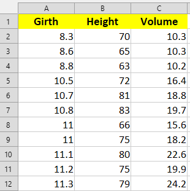

```{r, echo=FALSE, results='hide'}
knitr::opts_chunk$set(message = FALSE,  
                      warning = FALSE)   
```

# **Cách format file Excel** 

## **Câu 1** {#cau-1}

<!-- <style> -->
<!-- div.blue pre { background-color:#fff2cc; font-size: 22px; } -->
<!-- </style> -->

<!-- <div class = "blue"> -->

Bạn có dữ liệu sau về thông số đo lường của các cây black cherry.

```{r}
trees -> df

df[1:12, ]
```

Bạn hãy xuất ra file Excel và có định dạng format như sau.



<!-- </div> -->

::: {.callout-tip collapse="true" title="Đáp án"}

<style>
div.yes123 pre { background-color:#fff2cc; font-size: 16px; }
div.yes123 pre.r { background-color:#F1F3F5; font-size: 16px; }
</style>
<div class = "yes123">

Cụm lệnh sau sẽ thực hiện theo logic:

* Bạn có một dataset `df`

* Sau đó ta tạo đối tượng `wb` đính kèm dataset này và các đặc điểm cần format

* Ta export ra file [`df_styled.xlsx`](https://github.com/tuhocr/homework/blob/main/dataset/df_styled.xlsx)

```{r}
trees -> df

library(openxlsx)

# lệnh này save file .xlsx như thông thường (without format)
# openxlsx:::write.xlsx(df, "df_trees.xlsx")

wb <- openxlsx:::createWorkbook()

openxlsx:::addWorksheet(wb, "Sheet 1")

openxlsx:::writeData(wb, "Sheet 1", df)

header_style <- openxlsx:::createStyle(fontSize = 12, 
                            fontColour = "black",
                            fgFill = "yellow", 
                            textDecoration = "bold",
                            halign = "center")

openxlsx:::addStyle(wb,
         sheet = "Sheet 1", 
         header_style, 
         rows = 1, 
         cols = 1:ncol(df), 
         gridExpand = TRUE)

openxlsx:::saveWorkbook(wb, "dataset/df_styled.xlsx", overwrite = TRUE)
```
</div>

:::


