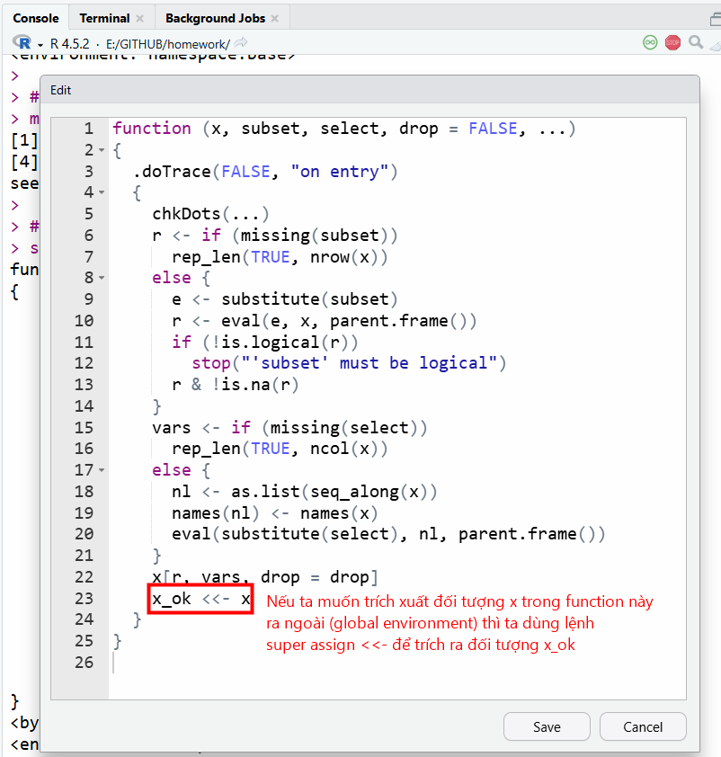
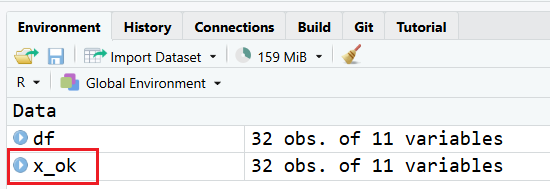
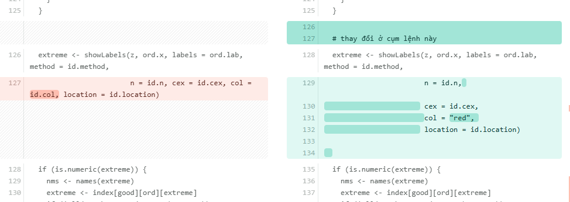

# **Cách xem source và edit function** 

Trong R có hai dạng function là S3 và S4 method, ngoài ra còn các dạng function khác. Phổ biến nhất là dạng S3 method (dạng căn bản), vì vậy các lệnh trong bài này được áp dụng cho việc truy vấn các function S3 method, nhằm hỗ trợ việc tùy chỉnh, đọc hiểu cấu trúc câu lệnh được tốt hơn, từ đó giúp ta dễ dàng truy ra phương pháp tính toán cho các tình huống cụ thể.

Để nắm chắc kiến thức về function trong R, các bạn xem ở section 25 về cách xây dựng function trong R nhé. [Bài giảng](https://class.tuhocr.com/khoa-hoc/coding-in-r/bai-hoc/dinh-nghia-function-va-cac-thuat-ngu-lien-quan/)

## **Các lệnh truy vấn function** 

Ta xét trường hợp lệnh `subset()` được dùng để trích xuất các thành phần trong data frame theo cột.

```{r}
# trích xuất giá trị cyl == 6 ở cột cyl
df <- mtcars |> subset(cyl == 6)
df
```

Giờ ta muốn xem ruột/source của function này thì cách làm như sau.

```{r}
# gõ trực tiếp tên function
subset
```

Khi gõ riêng tên function, ta thấy có `UseMethod("subset")` nghĩa là function này là 1 function chung (generic), nó còn có các function con (method) tương ứng từng loại (class) đối tượng để subset. Ta truy vấn tiếp lệnh này.

```{r}
methods("subset")
```

Kết quả trả về sẽ là các function con cụ thể, function nào có dấu hoa thị `*` là dạng function bị ẩn, các function này ta gọi trực tiếp bằng lệnh `ten_package:::ten_function()` để truy đến package gốc chứa function đó.

Khi gõ tên function cụ thể ra, ta đọc được source của function này. Đặc điểm function trong R sẽ tạo ra các đối tượng hoạt động trong môi trường riêng biệt (local environment) sẽ không hiển thị ở (global environment), do đó cụm `bytecode: 0x0000012babb1b2d8` chính là mã ID của vùng local environment mà tại đó các đối tượng trong ruột function sẽ tồn tại để thực hiện các bước tính toán.

```{r}
# ở đây ta có `mtcars` thuộc class(mtcars) là data.frame
# nên lệnh subset (dấu chấm) data.frame sẽ là lệnh
# thực hiện chính công việc subset dữ liệu này
subset.data.frame
```

```{r, eval=FALSE}
base:::subset.data.frame
```

Giờ ta muốn can thiệp/thay đổi function `subset` này ngay trong phiên làm việc/session thì ta dùng lệnh `trace`

```{r, eval=F}
# có thể để tên function trong dấu "" hoặc không cần cũng được.
# tốt nhất để trực tiếp tên function without quoted
trace(what = subset.data.frame,
      tracer = FALSE,
      edit = TRUE)
```



Thay đổi nội dung function ngay trong phiên làm việc (nếu ta restart RStudio thì function sẽ trở lại trạng thái ban đầu, không bị ghi đè các thay đổi này), phương pháp này rất hữu ích để ta debug/dò ra các biến trung gian và cơ chế hoạt động của function để modify lại theo ý của mình.

Gọi lại function, lúc này trên global environment xuất hiện đối tượng `x_ok` từ trong local environment của lệnh `subset.data.frame`.

```{r}
df <- mtcars |> subset(cyl == 6)
df
```




## **Truy vấn function từ package**

Cách làm cũng tương tự như trên, ta lưu ý khi dùng function từ package nào thì cần gọi trực tiếp đến tên function gốc theo cú pháp `:::`.

```{r, fig.width=4, fig.height=4, results='hide', message=FALSE, warning=FALSE}
library(car)
# vẽ lần 1 bằng lệnh qqPlot
car:::qqPlot(trees$Height)
```

```{r}
qqPlot

methods("qqPlot")
```

```{r, eval=FALSE}
# khi dò được function gốc rồi ta dễ dàng xem được
# source của function này để chỉnh sửa
car:::qqPlot.default(trees$Height)
```

```{r, eval=FALSE}
# chỉnh sửa trực tiếp trong phiên làm việc
trace(what = car:::qqPlot.default,
      tracer = F,
      edit = TRUE)
```

**Nếu muốn tìm xem function nào thuộc package nào, các bạn có thể dùng các lệnh sau.**

```{r, eval=F}
library(car)

# tìm xem function này thuộc package nào
getAnywhere(qqPlot)

# tìm xem function này thuộc package nào (chỉ áp dụng cho các function đã được load/library trong phiên làm việc)
find("qqPlot")

# tìm xem function nayù thuộc package nào
environment(qqPlot)
environmentName(environment(qqPlot))

# tìm các đối tượng có cùng tên này 
apropos("qqPlot")

# xác định xem function này có tồn tại
exists("qqPlot", mode = "function")
```


## **Câu 1** {#cau-1}

Dựa trên kiến thức về function, bạn hãy tùy chỉnh lại function `car:::qqPlot.default` để khi vẽ ra các điểm outlier thì sẽ tô màu đỏ ở phần label. Kết quả giống như hình này.

Gợi ý cách làm:

1. Ta sẽ gọi riêng lệnh `car:::qqPlot.default` này ra ngoài console để copy source của function, lưu trong 1 file script đặt tên là `qqPlot_enhanced.R`

2. Ta chỉnh sửa ruột function trong file script này và test xem hoạt động được như yêu cầu đề bài hay không. Cách tiếp cận là dò lần lượt từng cụm code và check, function nào trong ruột của function này mà có liên quan đến package khác thì ta sửa câu lệnh theo kiểu `:::` để gọi trực tiếp function đó ra. [minh họa](image/p7.png)

3. Sau khi xong hết bạn kiểm tra hoạt động 2 function `car:::qqPlot.default(trees$Height)` và `qqPlot_enhanced(trees$Height)` nếu ra cùng kết quả thì ta đã biết cách chỉnh sửa function theo ý của mình.


<style>
div.blue pre { background-color:#fff2cc; font-size: 22px; }
</style>

<div class = "blue">

```{r, echo = F, results='hide'}
par(mfrow = c(1,2))
car:::qqPlot.default(trees$Height,
                     main = "Lệnh gốc")

source("dataset/qqPlot_enhanced.R")
qqPlot_enhanced(trees$Height,
                main = "Lệnh được cải tiến")
```

</div>

::: {.callout-tip collapse="true" title="Đáp án"}

<style>
div.yes123 pre { background-color:#fff2cc; font-size: 16px; }
div.yes123 pre.r { background-color:#F1F3F5; font-size: 16px; }
</style>
<div class = "yes123">
```{r, eval=FALSE}
par(mfrow = c(1,2))
car:::qqPlot.default(trees$Height,
                     main = "Lệnh gốc")

# các bạn xem file source ở đây và chạy lại trên máy tính nhé
source("dataset/qqPlot_enhanced.R")
qqPlot_enhanced(trees$Height,
                main = "Lệnh được cải tiến")
```

Để thuận tiện đối chiếu giữa hai file code, các bạn copy source file [`qqPlot_ori.R`](https://github.com/tuhocr/homework/blob/main/dataset/qqPlot_ori.R) và [`qqPlot_enhanced.R`](https://github.com/tuhocr/homework/blob/main/dataset/qqPlot_enhanced.R), dùng chương trình compare code để đối chiếu xem đã có những thay đổi nào trong function cải tiến nhé. Mình thường dùng trang web này để đối chiếu file code [diffchecker](https://www.diffchecker.com/).


</div>

:::


