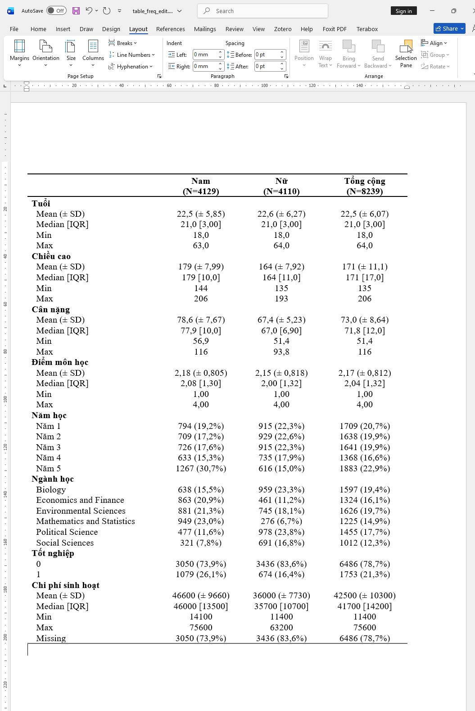

```{r, echo=FALSE, results='hide'}
knitr::opts_chunk$set(message = FALSE,  
                      warning = FALSE)   
```

# **Package `table1`** 

Đây là package chuyên để thực hiện thống kê mô tả rất hữu ích để tổng quát nhanh chóng một bộ dữ liệu, giúp tìm ra đặc điểm dữ liệu bị sai sót để người dùng có thể chỉnh sửa kịp thời. [[record]](https://youtu.be/PzdvA7pEczo?si=gvkGhjAflVKyFdic&t=7173)

## **Cú pháp cơ bản**

```{r}
library(table1)
library(flextable)
library(magrittr)
library(openxlsx)
library(dplyr)

mtcars$vs <- factor(mtcars$vs)
mtcars$cyl <- factor(mtcars$cyl)
mtcars$am <- factor(mtcars$am)
mtcars[1:3, 1:3] <- NA

table_freq <- table1:::table1.formula( ~ . | vs,
                     topclass="Rtable1-grid",
                     data = mtcars,
                    # digits = 4,
                    render.continuous = c("Mean (± SD)" = "MEAN (± SD)",
                                          "Median [Min, Max]" = "MEDIAN [MIN, MAX]")
                          )

table_freq
```

## **Thay dấu `.` decimal point thành dấu `,`**

Dataset minh họa [`sinhvien.xlsx`](https://github.com/tuhocr/homework/blob/main/dataset/sinhvien.xlsx)

```{r}
options("OutDec" = ",") # thay đổi dấu decimal ở đây

library(readxl)

sinhvien <- read_excel("dataset/sinhvien.xlsx")

sinhvien$`Tốt nghiệp` <- factor(sinhvien$`Tốt nghiệp`,
                                levels = )
# summary(sinhvien)

table_freq <- table1:::table1.formula( ~ . | `Giới tính`,
                     topclass="Rtable1-grid",
                     data = sinhvien[ , -1],
                    # digits = 4,
                    overall = "Tổng cộng",
                    render.continuous = c("Mean (± SD)" = "MEAN (± SD)",
                                          "Median [IQR]" = "MEDIAN [IQR]",
                                          "Min" = "MIN",
                                          "Max" = "MAX")
                          )

table_freq
```

## **Xuất kết quả ra file Word và Excel**

```{r, eval=FALSE}
# export ra word
table1:::t1flex(table_freq) %>%
  flextable:::save_as_docx(path = "dataset/table_freq.docx")

# export ra excel
openxlsx:::write.xlsx(table_freq, file = "table_freq.xlsx")
```

>Mặc định thì format xuất ra Word sẽ chưa đẹp lắm, ta có thể vào mục Table Layout/Chọn AutoFit Window, sau đó chọn font chữ và size chữ phù hợp. Để các dòng khít lại với nhau, ta vào mục Layout, chọn Spacing (Before và After = 0 pt).




<!-- ```{r} -->
<!-- ### render các biến category (gsub dấu . thành dấu ,) -->
<!-- my.render.cat <- function(x) {  -->

<!--   gsub(pattern = '.',  -->
<!--        replacement = ',',  -->
<!--        x = c("",  -->
<!--              sapply(table1:::stats.default(x),  -->
<!--                     FUN = function(y) { with(y,  -->
<!--                                              sprintf("%0.0f (%0.2f %%)",  -->
<!--                                                      FREQ,  -->
<!--                                                      PCT))} -->
<!--                         )), -->
<!--        fixed = TRUE)  -->


<!-- } -->

<!-- ### render các biến numeric -->

<!-- render.continuous.all <- function(x) { -->

<!--     with(stats.default(x), -->
<!--          c("", -->
<!--            "Mean (SD)" = sprintf("%s (± %s)", -->
<!--                                  signif_pad(MEAN, digits = 3, decimal.mark = ","), -->
<!--                                  signif_pad(SD, digits = 3, decimal.mark = ",")), -->

<!--            "Median [Min, Max]" = sprintf("%s [%s ; %s]", -->
<!--                                          signif_pad(MEDIAN, digits = 3, decimal.mark = ","), -->
<!--                                          signif_pad(MIN, digits = 3, decimal.mark = ","), -->
<!--                                          signif_pad(MAX, digits = 3, decimal.mark = ","))) -->
<!--          ) -->

<!-- } -->

<!-- ### -->

<!-- table_freq <- table1:::table1.formula( ~ . | vs, -->
<!--                        data = mtcars, -->
<!--                        topclass="Rtable1-grid", -->
<!--                        render.categorical = my.render.cat, -->
<!--                        render.continuous = render.continuous.all -->
<!--                        ) -->

<!-- table_freq -->
<!-- ``` -->


[**Credit: Cảm ơn Dr. Lê Kiều Chinh đã đề xuất câu hỏi để mình tìm cách format thay dấu chấm bằng dấu phẩy ở số thập phân từ kết quả xuất ra của package `table1`.**]{style="color:#FF4081"}

## **Tham khảo**

<https://cran.r-project.org/web/packages/table1/vignettes/table1-examples.html>

<https://github.com/benjaminrich/table1/issues/34>

<!-- ### render các biến numeric (gsub dấu . thành dấu ,) -->
<!-- # my.render.mean <- function(x) { -->
<!-- #  -->
<!-- #   gsub(pattern = '.', -->
<!-- #        replacement = ',', -->
<!-- #  -->
<!-- #        x = with(stats.default(x), -->
<!-- #         sprintf("%0.4f (%0.4f)", -->
<!-- #                 MEAN, -->
<!-- #                 SD)), -->
<!-- #  -->
<!-- #        fixed = TRUE) -->
<!-- #  -->
<!-- #  -->
<!-- # } -->

<!-- # my.render.median <- function(x) {  -->
<!-- #    -->
<!-- #   gsub(pattern = '.',  -->
<!-- #        replacement = ',',  -->
<!-- #         -->
<!-- #        x = with(stats.default(x),  -->
<!-- #                  -->
<!-- #         sprintf("%0.2f [%0.2f ; %0.2f]",  -->
<!-- #                 MEDIAN,  -->
<!-- #                 MIN, -->
<!-- #                 MAX)), -->
<!-- #         -->
<!-- #        fixed = TRUE)  -->
<!-- # } -->
